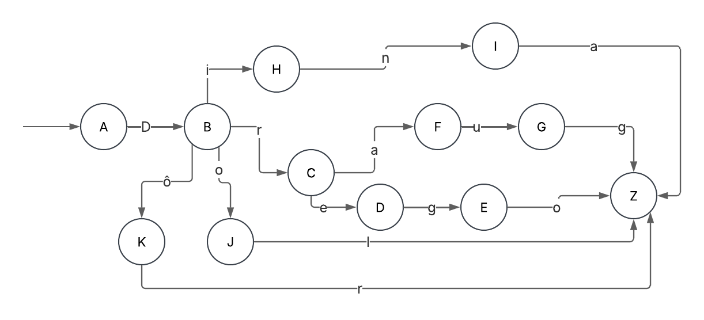

# Evidence 1: Implementation of Lexical Analysis Automaton and Regular Expression.
Aksel Deneken Maldonado A01711966
## Description

For this evidence I chose the Sindarin language, created by J.R.R Tolkien and used in The Lord of the Rings and The Hobbit. “It is the most widely spoken Elvish language in Middle-earth during the Third Age, spoken by Men and Elves alike” ( Sindarin Hub, 2024). It is Welsh inspired and has similar sounds and similar phonotactics.

I specifically chose 5 words of this language :

1. Dina - Means ‘Be Silent’
2. Dol - Meaning ‘Head`, often given to hills and mountains 
3. Dôr - Sindarin for 'land'.
4. Draug - 'wolf'.
5. Drego - Sindarin word which means 'Flee'.

In this evidence, the automaton used to analyze the input words is a Deterministic Finite Automata (DFA). In this type of automaton , for each input character or symbol, there is exactly one transition from the current state to the following one. This ensures that the automaton can only be in one state at a time for a given input sequence.

I implemented  a DFA because the goal is to process the set of words mentioned before and determine whether they are valid based on their characters. Each valid word follows a different and unique path through the states.

## Why a DFA?

- Each input character leads to a unique state, making it easy to determine if the word is valid.
- A DFA is easier to implement compared to a NFA since a Non deterministic Finite Automaton can have multiple possible transitions for the same character.
- Since the automaton only needs to check a specific sequence of states for each word, it is great for this case because we only have a limited set of words that are expected.

## Models

I generated only one automaton for this language, to accept only the specific set of words mentioned before.  With that said, the automaton is only valid for the following alphabet:

∑ = a, D, e, g, i, l, n, o, ô, r, u

Any other character is not accepted.

Here’s the automaton I made:


The automaton starts in state a.

For the word dina: d → i → n → a

For dol: d → o → l

For dôr: d → ô → r

For draug: d → r → a → u → g

For drego: d → r → e → g → o
All these paths end in the accepting state z.

This can also be represented using a regular expression, which provides an alternative method of describing the valid words that the automaton accepts.

This automaton can be represented by the following regular expression:

( ^D )(( r( aug | ego )) | ( ina ) | ( ol ) | ( ôr ))

## Implementation

The transitions of the designed automaton are defined using “move”. This specifies how the automaton moves from one state to another based on the input character.

```prolog
% Basic form: move(InitialState, NextState, Letter).
move(a,b,d).
move(b,h,i).
move(b,c,r).
move(b,j,o).
move(b,k,ô).
move(c,f,a).
move(c,d,e).
move(h,i,n).
move(j,z,l).
move(k,z,r).
move(f,g,u).
move(d,e,g).
move(i,z,a).
move(g,z,g).
move(e,z,o).
```

Each “move(InitialState, NextState, Letter).” indicates that from a state, the automaton goes to the “NextState” when it reads the input letter. This defines the valid transitions for each word and the structure of the automaton.

The accepting state of the automaton is defined as:

```prolog
accepting_case(z).
```

This means that if the automaton ends in the “z” state, the word is accepted (true).

The “use_automaton” is the main predicate. It takes a word as input and converts it to a list of characters using “atom_chars” to then call the recursive rule “automatonCheck” to check the letters one by one.

“atom_chars” is a built in predicate that converts an atom into a list of characters.

```prolog
use_automaton(Word) :-
    atom_chars(Word, ListChar), 
    automatonCheck(ListChar, a).
```

The base case represents the situation where the list of letters is empty.

```prolog
automatonCheck([], InitialState) :-
    accepting_case(InitialState).
```

The recursive rule processes each letter in the input word, checks the current state and, if a valid “move” is possible, it moves to the next state. And this repeats itself until all letters have been read.

```prolog
automatonCheck([Letter| RestChar], InitialState) :-
    move(InitialState, NextState, Letter),
    automatonCheck(RestChar, NextState).
```

All of these, are implemented on the main file sindarin.pl. If the input is in the set of words defined previously it returns true, otherwise it returns false.


## Test

To run the program, first open sindarin.pl in Prolog or a Prolog terminal. Then, to open the file, you need to run the following command:

```prolog
["route_to_the_file/sindarin.pl"].
```

### Successful Tests:

On this list are several test that should return “true”, as they are the words that were defined in the automaton and belong to the Sindarin language: 

- dina
- dol
- dôr
- draug
- drego

### Unsuccessful Tests:

Below are words that are similar to the valid sequences in the Sindarin language but are not valid according to the automaton. Running this words will return false:

- droga
- dor
- doli
- dinha
- drauh

### Running Tests:

To run the automated tests through the automaton, use the *run_tests.* predicate. The expected result for each test will be displayed.

```prolog
run_tests.
```
You will see output like the following:
```prolog
dina: true passed
dol: true passed
dôr: true passed
draug: true passed
drego: true passed
droga: false passed
dor: false passed
doli: false passed
dinha: false passed
drauh: false passed
1true
```
If the result is true, it means the word is valid (accepted by the automaton). If it was supposed to be valid, the test passes.

If the result is false, it means the word is invalid (not accepted by the automaton). If it was supposed to be invalid, the test also passes.

So even if you see "false passed", that’s correct bcause the automaton rejected the word (false), and that’s exactly what it was supposed to do (passed).

## Analysis

### Time Complexity

The total time complexity of processing a word through my automaton is O(n), where n is the length of the input word. This is because my prolog program processes each letter of the word exactly once.

### Other Solutions

In Python, an alternative solution to implement a finite automaton for lexical analysis can be achieved using an approach with a dictionary for state transitions. I asked ChatGPT to implement this solution to analyze it further.

```python
class FiniteAutomaton:
    def __init__(self):
        # Define transitions as a dictionary
        self.transitions = {
            'a': {'d': 'b'},
            'b': {'i': 'h', 'r': 'c', 'o': 'j', 'ô': 'k'},
            'c': {'a': 'f', 'e': 'd'},
            'h': {'n': 'i'},
            'j': {'l': 'z'},
            'k': {'r': 'z'},
            'f': {'u': 'g'},
            'd': {'g': 'e'},
            'i': {'a': 'z'},
            'g': {'g': 'z'},
            'e': {'o': 'z'}
        }
        self.accepting_state = 'z'

    def check_sequence(self, input_sequence):
        current_state = 'a'  # Start state
        for symbol in input_sequence:
            if current_state in self.transitions and symbol in self.transitions[current_state]:
                current_state = self.transitions[current_state][symbol]
            else:
                return False  # No transition found for the symbol
        return current_state == self.accepting_state

# Example usage
automaton = FiniteAutomaton()
print(automaton.check_sequence(['d', 'i', 'n', 'a']))  # Expected: True
print(automaton.check_sequence(['d', 'o', 'l']))      # Expected: True
print(automaton.check_sequence(['d', 'r', 'o', 'g']))  # Expected: False

```

OpenAI. (March 24, 2025). Automata Code in Python.

The finiteAutomaton class has a method that checks if a word follows the correct sequence of states based on the input leters. This method loops through each character in the input word and checks if it goes to a valid state, returning True if the word ends at the accepting state and False otherwise. This solution is different from the Prolog version, as it uses an approach with loops instead of recursion.

Both solutions achieve the same goal but, in my opinion, each one has a different implementation complexity. In Python, the solution uses loops to do the transitions, making it easier to understand and manage the transitions. On the other hand, the Prolog solution uses recursion, where each state transition is handled through recursive function calls. The implementation in Python requires managing a class and iterating over the transitions, which, for me, adds extra complexity compared to the Prolog solution, where the logic is more straightforward and easy to understand. Althuogh both solutions have the same time complexities of O(n), the Python solution requires more code and structures like classes and loops, while Prolog's recursion keeps the code simple. 

## References

Prolog, A. (n.d.). *atom_chars/2*. ALS Prolog. https://alsprolog.com/docs/ref/atom_chars.html

TutorialsPoint. (2025, March 21). *Deterministic finite Automaton tutorial*. https://www.tutorialspoint.com/automata_theory/deterministic_finite_automaton.htm

Gateway, T. (2024, October 5). *Sindarin - Tolkien Gateway*. Tolkien Gateway. https://tolkiengateway.net/wiki/Sindarin

*SINDARIN HUB*. (n.d.). SINDARIN HUB. https://sindarinlessons.weebly.com/
